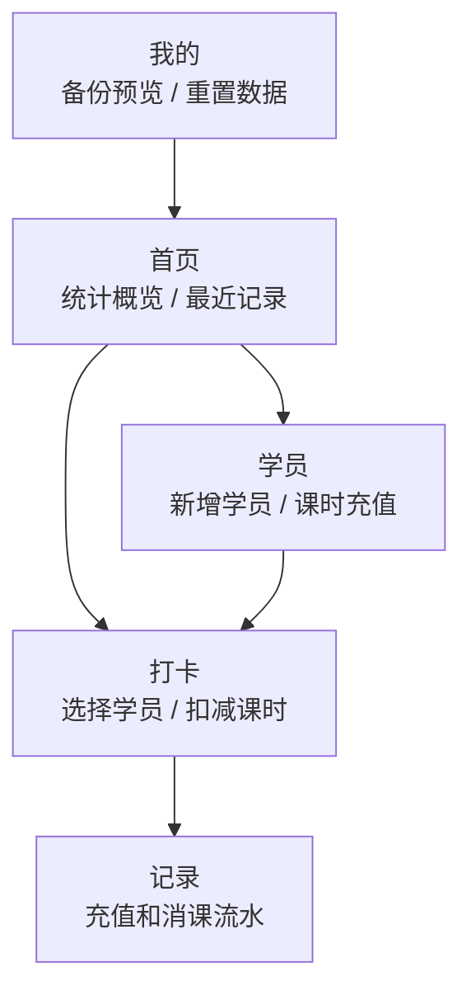
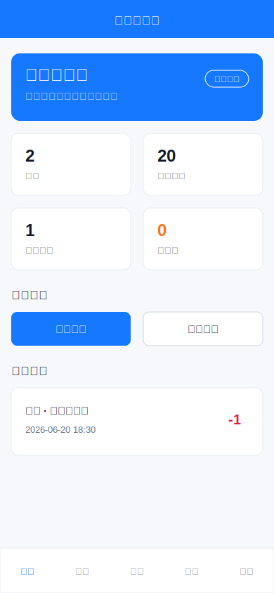
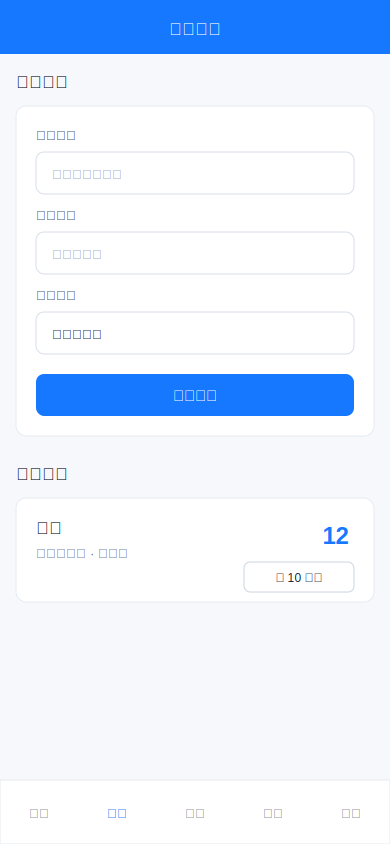
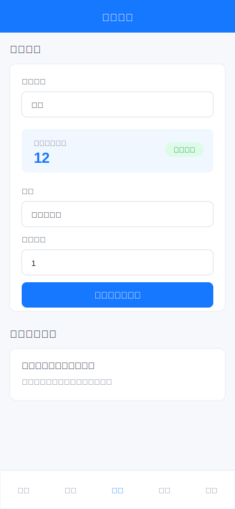
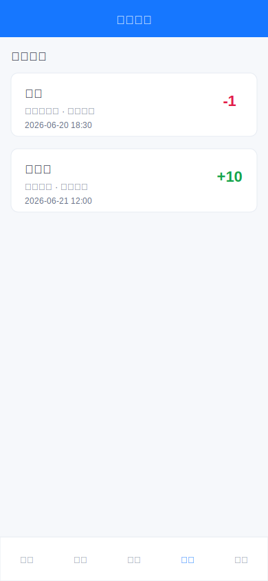
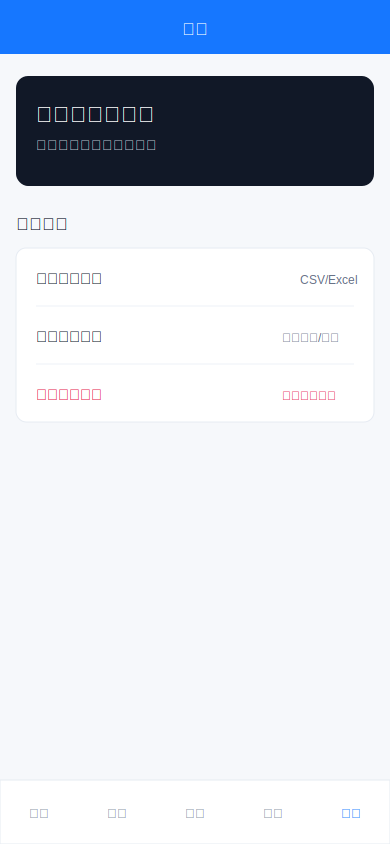
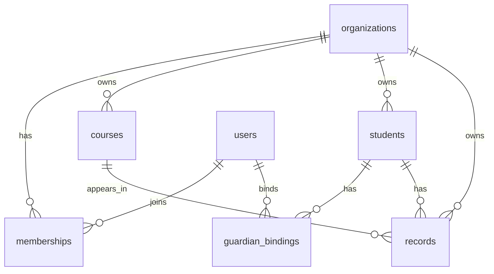

# 课时小伙伴小程序使用说明

本文档面向产品试用、开发交接和后续上线准备。当前仓库实现的是「免费试用 MVP」：数据通过微信云开发保存，角色权限已经在云函数中预留，家长端和通知能力属于正式版扩展设计。

## 1. 角色与功能

### 1.1 当前 MVP 角色

当前版本默认所有试用用户都是「机构管理员」，可以操作全部页面：

| 页面 | 当前可用功能 |
| --- | --- |
| 首页 | 查看学员数、剩余课时、本月消课、低余额提醒、最近记录 |
| 学员 | 新增学员、查看课时余额、给学员充值 10 课时 |
| 打卡 | 选择学员和课程，填写扣减课时，上课打卡并自动消课 |
| 记录 | 查看充值和消课流水 |
| 我的 | 查看云端演示机构信息、备份预览、家校协同说明、重置演示数据 |

### 1.2 正式版建议角色

| 角色 | 适用对象 | 主要功能 | 不建议开放的功能 |
| --- | --- | --- | --- |
| 机构管理员 | 校长、机构负责人 | 机构设置、员工管理、学员管理、课程管理、充值、消课、数据导出、查看所有统计 | 无 |
| 教务/前台 | 负责排课和学员管理的员工 | 新增学员、课时充值、上课打卡、补卡、记录查询、余额提醒 | 删除机构、修改高级权限、查看敏感财务汇总 |
| 老师 | 任课教师 | 查看自己负责的学员/班级、上课打卡、填写课堂备注、查看自己的上课记录 | 课时充值、删除记录、导出全机构数据 |
| 家长 | 学员家长 | 绑定学员、查看剩余课时、查看上课记录、接收消课通知、查看课堂备注 | 修改课时、打卡消课、查看其他学员 |
| 学员 | 年龄较大的学员本人 | 查看课表、剩余课时、个人上课记录 | 管理类功能 |
| 访客试用 | 未登录体验用户 | 使用演示数据体验首页、学员、打卡、记录流程 | 保存到正式云端、邀请家长、发送通知 |

### 1.3 权限矩阵

| 功能 | 管理员 | 教务 | 老师 | 家长 | 学员 | 访客试用 |
| --- | --- | --- | --- | --- | --- | --- |
| 查看首页统计 | 是 | 是 | 部分 | 否 | 否 | 是 |
| 新增/编辑学员 | 是 | 是 | 否 | 否 | 否 | 是 |
| 课时充值 | 是 | 是 | 否 | 否 | 否 | 是 |
| 上课打卡消课 | 是 | 是 | 是 | 否 | 否 | 是 |
| 查看课时流水 | 是 | 是 | 仅自己相关 | 仅绑定学员 | 仅本人 | 是 |
| 家长绑定 | 是 | 是 | 否 | 是 | 否 | 否 |
| 消课通知 | 是 | 是 | 可触发 | 可接收 | 可接收 | 否 |
| 数据导出/备份 | 是 | 可配置 | 否 | 否 | 否 | 仅预览 |
| 员工和权限管理 | 是 | 否 | 否 | 否 | 否 | 否 |

## 2. 功能截图与画面迁移

当前示意图放在 `docs/screenshots/` 下。它们是按现有小程序页面制作的画面示意，正式发布前建议用微信开发者工具或真机重新截取真实截图后替换。

### 2.1 整体页面流转



### 2.2 首页



功能说明：

- 展示当前机构的学员数量、剩余课时、本月已消课时、低余额学员数。
- 显示最近课时流水。
- 可从「上课打卡」进入打卡页。
- 可从「新增学员」进入学员页。

画面迁移：

| 用户操作 | 跳转目标 |
| --- | --- |
| 点击「上课打卡」 | 打卡页 |
| 点击「新增学员」 | 学员页 |
| 点击底部 Tab「记录」 | 记录页 |
| 点击底部 Tab「我的」 | 我的页 |

### 2.3 学员管理



功能说明：

- 填写学员姓名、家长姓名、联系电话、报名课程、初始课时。
- 点击「保存学员」后新增到学员列表。
- 点击「充 10 课时」后增加余额，并生成一条充值流水。

画面迁移：

| 用户操作 | 跳转/结果 |
| --- | --- |
| 点击「保存学员」 | 留在当前页，刷新学员列表 |
| 点击「充 10 课时」 | 留在当前页，课时余额增加并写入记录 |
| 点击底部 Tab「打卡」 | 打卡页 |

### 2.4 上课打卡



功能说明：

- 选择学员后展示当前剩余课时。
- 选择课程、填写扣减课时和课堂备注。
- 点击「确认打卡并消课」后扣减学员课时，并写入消课流水。
- 当剩余课时不足时，不允许打卡。

画面迁移：

| 用户操作 | 跳转/结果 |
| --- | --- |
| 选择学员 | 当前页刷新余额和默认课程 |
| 点击「确认打卡并消课」 | 留在当前页，余额减少，记录页新增流水 |
| 点击底部 Tab「记录」 | 记录页查看消课结果 |

### 2.5 上课记录



功能说明：

- 按时间倒序展示课时流水。
- 消课记录显示负数，充值记录显示正数。
- 每条记录包含学员、课程/操作类型、备注、课时数、时间。

画面迁移：

| 用户操作 | 跳转/结果 |
| --- | --- |
| 点击底部 Tab「学员」 | 学员页 |
| 点击底部 Tab「打卡」 | 打卡页 |
| 点击底部 Tab「我的」 | 我的页 |

### 2.6 我的/数据管理



功能说明：

- 显示当前演示机构。
- 「导出备份预览」展示当前学员数和流水数，正式版可扩展 CSV/Excel 导出。
- 「家校协同预留」展示家长绑定、通知、课堂点评等后续功能说明。
- 「重置演示数据」清空当前云端演示数据，并恢复初始演示数据。

画面迁移：

| 用户操作 | 跳转/结果 |
| --- | --- |
| 点击「导出备份预览」 | 弹窗展示备份摘要 |
| 点击「家校协同预留」 | 弹窗展示后续规划 |
| 点击「重置演示数据」 | 确认后恢复默认数据 |

## 3. 后台保存的数据结构

### 3.1 当前 MVP 云开发结构

当前版本使用微信云开发。前端统一调用云函数：

```text
cloudfunctions/api
```

云函数读写以下云数据库集合：

```text
organizations
users
memberships
courses
students
lesson_records
```

### 3.2 courses 课程表

当前字段：

| 字段 | 类型 | 说明 |
| --- | --- | --- |
| id | string | 课程 ID |
| name | string | 课程名称 |
| unit | number | 默认每次消耗课时 |

示例：

```json
{
  "id": "course_piano",
  "name": "钢琴一对一",
  "unit": 1
}
```

正式后台建议字段：

| 字段 | 类型 | 说明 |
| --- | --- | --- |
| id | string | 课程 ID |
| orgId | string | 所属机构 ID |
| name | string | 课程名称 |
| defaultUnit | number | 默认消耗课时 |
| status | string | enabled / disabled |
| createdAt | datetime | 创建时间 |
| updatedAt | datetime | 更新时间 |

### 3.3 students 学员表

当前字段：

| 字段 | 类型 | 说明 |
| --- | --- | --- |
| id | string | 学员 ID |
| name | string | 学员姓名 |
| guardian | string | 家长姓名 |
| phone | string | 联系电话 |
| courseId | string | 报名课程 ID |
| remaining | number | 剩余课时 |
| status | string | 学员状态 |

示例：

```json
{
  "id": "stu_chenxi",
  "name": "陈曦",
  "guardian": "陈妈妈",
  "phone": "13800000001",
  "courseId": "course_piano",
  "remaining": 12,
  "status": "正常"
}
```

正式后台建议字段：

| 字段 | 类型 | 说明 |
| --- | --- | --- |
| id | string | 学员 ID |
| orgId | string | 所属机构 ID |
| name | string | 学员姓名 |
| guardianName | string | 家长姓名 |
| guardianPhone | string | 家长手机号 |
| boundUserIds | string[] | 已绑定家长微信用户 ID |
| courseIds | string[] | 报名课程 ID 列表 |
| remainingHours | number | 当前剩余总课时 |
| status | string | active / paused / archived |
| createdAt | datetime | 创建时间 |
| updatedAt | datetime | 更新时间 |

### 3.4 lesson_records 课时流水表

当前字段：

| 字段 | 类型 | 说明 |
| --- | --- | --- |
| id | string | 流水 ID |
| studentId | string | 学员 ID |
| studentName | string | 学员姓名快照 |
| courseName | string | 课程名称快照 |
| hours | number | 变动课时 |
| type | string | checkin / recharge |
| note | string | 备注 |
| createdAt | string | 创建时间 |

示例：

```json
{
  "id": "rec_seed_1",
  "studentId": "stu_chenxi",
  "studentName": "陈曦",
  "courseName": "钢琴一对一",
  "hours": 1,
  "type": "checkin",
  "note": "常规上课",
  "createdAt": "2026-06-20 18:30"
}
```

正式后台建议字段：

| 字段 | 类型 | 说明 |
| --- | --- | --- |
| id | string | 流水 ID |
| orgId | string | 所属机构 ID |
| studentId | string | 学员 ID |
| courseId | string | 课程 ID，充值类可为空 |
| teacherId | string | 上课老师 ID |
| operatorId | string | 操作人 ID |
| type | string | checkin / recharge / adjust / refund / expire |
| deltaHours | number | 课时变化，消课为负数，充值为正数 |
| balanceAfter | number | 操作后的剩余课时 |
| note | string | 备注 |
| classAt | datetime | 实际上课时间 |
| createdAt | datetime | 创建时间 |
| deletedAt | datetime? | 软删除时间 |

### 3.5 正式版建议新增表

#### organizations 机构表

```json
{
  "id": "org_001",
  "name": "课时小伙伴演示机构",
  "ownerUserId": "user_001",
  "plan": "free_trial",
  "createdAt": "2026-06-21T12:00:00+09:00",
  "updatedAt": "2026-06-21T12:00:00+09:00"
}
```

#### users 用户表

```json
{
  "id": "user_001",
  "openid": "wechat_openid",
  "nickname": "王老师",
  "phone": "13800000000",
  "createdAt": "2026-06-21T12:00:00+09:00"
}
```

#### memberships 成员权限表

```json
{
  "id": "member_001",
  "orgId": "org_001",
  "userId": "user_001",
  "role": "admin",
  "status": "active",
  "createdAt": "2026-06-21T12:00:00+09:00"
}
```

#### guardian_bindings 家长绑定表

```json
{
  "id": "bind_001",
  "orgId": "org_001",
  "studentId": "stu_001",
  "userId": "user_parent_001",
  "relation": "mother",
  "status": "active",
  "createdAt": "2026-06-21T12:00:00+09:00"
}
```

#### notifications 通知表

```json
{
  "id": "notice_001",
  "orgId": "org_001",
  "studentId": "stu_001",
  "receiverUserId": "user_parent_001",
  "type": "lesson_consumed",
  "title": "课时消耗通知",
  "content": "陈曦已完成钢琴一对一课程，扣减 1 课时。",
  "status": "sent",
  "createdAt": "2026-06-21T12:00:00+09:00"
}
```

### 3.6 数据关系



## 4. 上线前检查清单

- 微信登录：保存 `openid`，建立用户和机构关系。
- 数据隔离：所有业务表必须带 `orgId`。
- 权限校验：前端隐藏入口，后台仍要校验角色。
- 课时流水：不要只改学员余额，必须同时写入流水。
- 余额一致性：消课/充值需要事务或云函数原子操作。
- 家长隐私：家长只能看到自己绑定的学员。
- 数据导出：导出操作写入审计日志。
- 删除策略：学员和流水优先软删除，避免财务/课时记录丢失。
